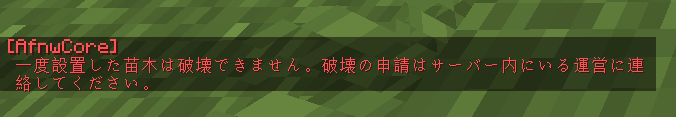
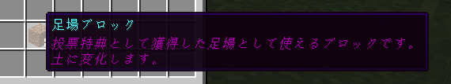

# Update v3.2.3

## 追加

### 苗木の破壊無力化機能

- 今後苗木を植えるとその地に苗木が固定化され、破壊できなくなります。
  - 苗木を破壊する荒らしに対応可能です。
  - 破壊が可能なのはオペレーター権限を持つプレイヤーのみです。
    - もし破壊したい場合は鯖内にいる運営に連絡してください。

### 土の確定配布

- １投票に8個、土を確定で配布するようになりました。

## 変更

- 以下のアイテムが配布されなくなります。
  - デバック棒
  - バリアブロック
  - ライトブロック
  - ジグソーブロック
